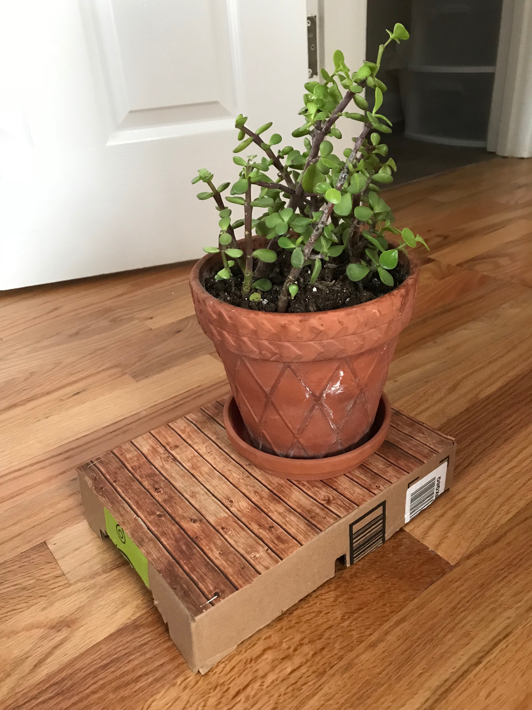
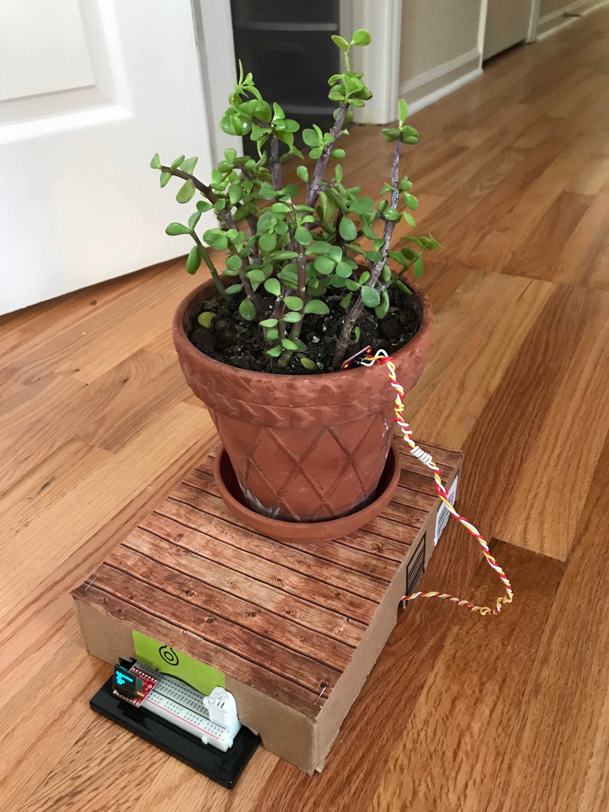
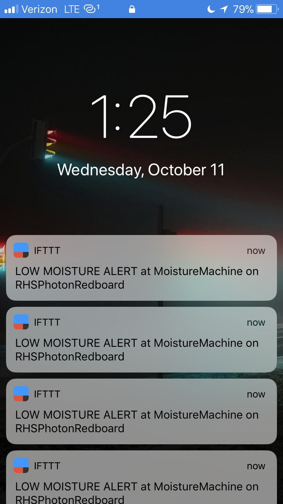
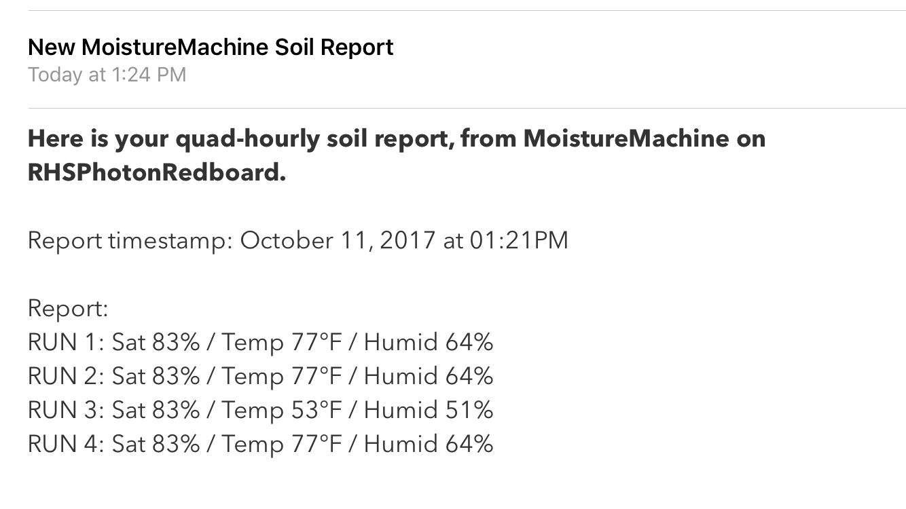
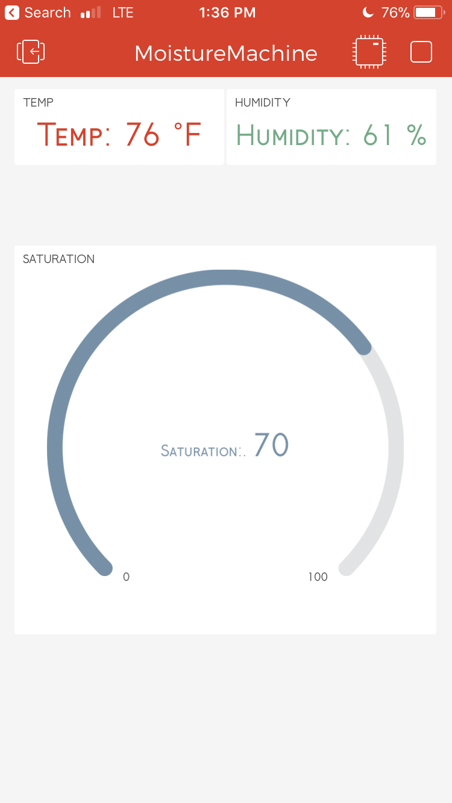
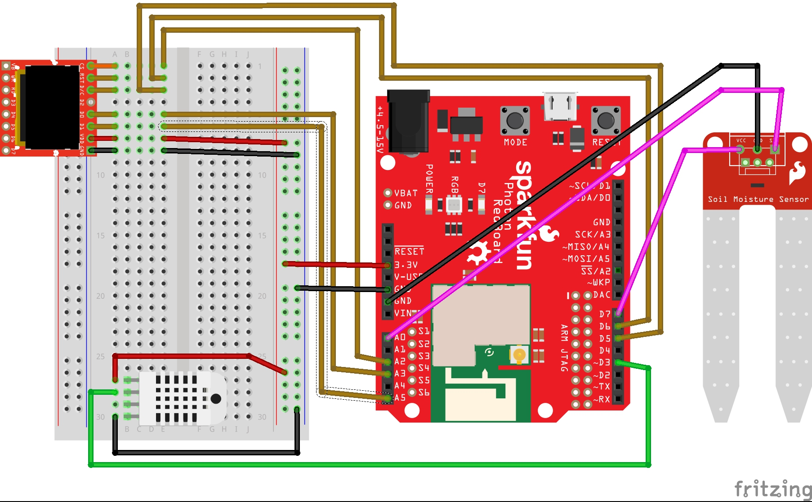

NOTE: GitHub does not support photo EXIF data in Markdown, so some images are rotated. I have been unable to find a fix for this.

## MoistureMachine

### Conceptual Description

MoistureMachine is a critical response to the concept of open-data, data ownership, and corporate cloud surveillance and privacy. At its core, MoistureMachine is a comprehensive system for monitoring the environment around a plant, but importantly, all data collected by the microcontroller is always available and proactively delivered to the user.

I started out by looking at a list of available sensor and actuators and building a device from the parts included in the SparkFun kit. I believe that, once purchasing or owning a device, users should be able to see every data point collected from them or their property, especially if this data is subsequently pushed to the cloud and viewed or manipulated by someone else. Thus, I wanted to make the data collected by MoistureMachine not only available, but easily accessible, so that users wouldn't have to dig for their data. With MoistureMachine, users automatically receive every single data point that is collected. Since MoistureMachine is open source, users can see exactly where their data is going and how it is being collected. However, since IFTTT is used for emails and notifications, there is a potential ambiguity associated with what IFTTT might do with user data. This is another important perspective revealed through this project--though I built an open-data and open-source device, it is nevertheless nearly impossible to escape completely protecting user data from third party entities.

MoistureMachine conforms to the principles of open-data and user ownership through the following functionalities:

1. Every four hours, the user is sent an email that contains all data points recorded by MoistureMachine during the previous four hourly runs (the time between each run can be customized, such as once every two hours with a report every eight hours)
2. Data can be visualized in real-time through an applet on the Blynk platform
3. The user can see the current soil saturation reading on the onboard OLED screen

My ultimate goal through this project was to create a device through which users need not worry about how their data is being collected, who really owns it, and where it is going.


### Form

When considering an enclosure for my device, it was important to leave both the OLED screen and temperature sensor exposed so that they could respectively convey and record accurate data. Furthermore, the moisture sensor had to be left exposed since it had to be placed in the plant soil. Importantly, I wanted the user to be able to easily move the moisture sensor to different parts of the soil, so I attached longer wires to make the sensor easily moveable. In this sense, the hardware itself is "open" to the user, in that the user has some control over how the hardware functions, since the user can choose where in the soil to place the moisture sensor.

I wanted the rest of the enclosure to protect the microcontroller from the external environment. Importantly, I needed to keep plant moisture away from the internal electronics. I used a cardboard box to make a platform that the plant could sit on top of so that I could place the microcontroller underneath. The plant sits in a water dish so that risk of water exposure to the electrinics is minimized. The OLED screen and temperature sensor require use of the breadboard, so one end of the breadboard is partially exposed so that those components are visible. This way, the user can easily glance at the plant and see the current saturation percentage, and the temperature sensor can properly record readings from the outside environment.

**Finished Enclosure:**



**Electronics Exposed**




**Low Moisture Notification**



**Data Report**



**Blynk**




### Technical Details

The following hardware components were used:

* SparkFun Photon Redboard
* Half+ breadboard
* SparkFun Micro OLED Breakout
* RHT03 Temperature and Humidity sensor
* SparkFun Soil Moisture Sensor

The moisture sensor was difficult to calibrate. The sensor itself is very sensitive and must be calibrated to the particular soil type that you are using. As a result, results may vary when used with a different plant without calibration.

The firmware initializes by starting the OLED screen, initializing the soil moisture sensor, configuring the RHT03 sensor, subscribing to the `rob-camila` event, and initializing the Blynk communication protocol. Then, a loop is executed with a delay based off of a definition property. The loop is configured by default to run every hour.

Each iteration of the loop begins by reading the RHT03 and soil moisture sensor. The saturation reading is calibrated and scaled to a percentage so that it is easily understandable by the user. This percentage is then printed to the OLED screen. The following code describes the algorithm used to scale raw readings (`rawReading`) to a percentage. The `baseline` value corresponds to the value read when the soil is completely dry while the `max` value corresponds to the maximum saturation reading.

```
int scaleReading(int rawReading) {
  int baseline = 2200;
  int max = 3300;
  if (rawReading < baseline) {
    return 0;
  }
  return (int)((rawReading - baseline) * ((float)100 / (float)(max - baseline)));
}
```

After reading sensor data, the values are pushed to Blynk so that users can monitor their data in real-time. Then, an event is published to `rob-camila`, triggering Camila Vargas' device to sound a tone from its Piezo speaker.

Afterwards, the sensor data is summarized in a string that is added to a `summary` instance variable containing all data points collected thus far. After four runs of the loop, the `DATA_REPORT` event is published, and the `summary` instance variable is pushed along with it as the payload. Via IFTTT, this string is placed in the body of an email sent to the user summarizing all data collected in the four runs. This email report was a bit difficult to set up; there is a 255 byte limit on payloads sent to IFTTT for an email trigger. As a result, I am limited to delivering four runs of data per email.

Lastly, the `summary` instance variable is cleared after the email report is made, the number of runs reset, and the loop repeats after the time denoted by `DELAY`.

There is also a function, `externalAlert`, that accepts an event `rob-camila` published by Camila Vargas' device. When the event is received, its payload is printed to the OLED screen.

**Wiring Diagram**



**Works Cited**

* [Moisture sensor tutorial](https://learn.sparkfun.com/tutorials/soil-moisture-sensor-hookup-guide)

* [OLED screen tips](https://learn.sparkfun.com/tutorials/sparkfun-inventors-kit-for-photon-experiment-guide/experiment-10-pong)
